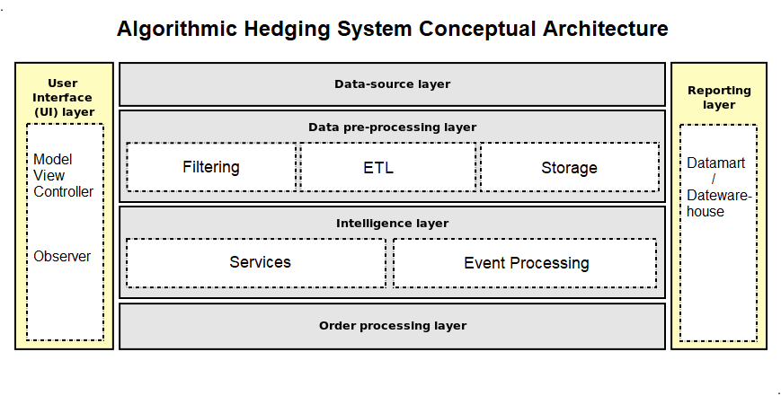

# Algorithmic Hedging System

## Conceptual Architecture / Model

## System Components

### Functional Requirements
### Non-Functional Requirements

- Scalability: ability to cope and perform under expanding workload
    - Number of data feeds
    - Number of market instruments
    - Number of hedging strategies
    - Number of users?

- Performance: amount of work accomplished per unit of time and resources
    - Memory efficient
    - Processor efficient
    - Network efficient
    - Data processing efficient

- Modifiability: ease with which changes can be implemented
    - Changes to hedging strategies
    - Changes to hedging instruments
    - Changes to data processing

- Reliability: ability to stay accurate and dependable
    - Deterministic
    - Free of bugs?

- Auditability: ability to track and report the chain of events that lead to any action taken

- Fault tolerance: ability for continous proper operation after failure
    - State recovery after fault

- Interoperability: ease with which the system is able to function with others
    - Exhchanges
    - Wallet modification

## Proposed Action Plan

1. 
1. 

## Deliverables

1. 
1.

